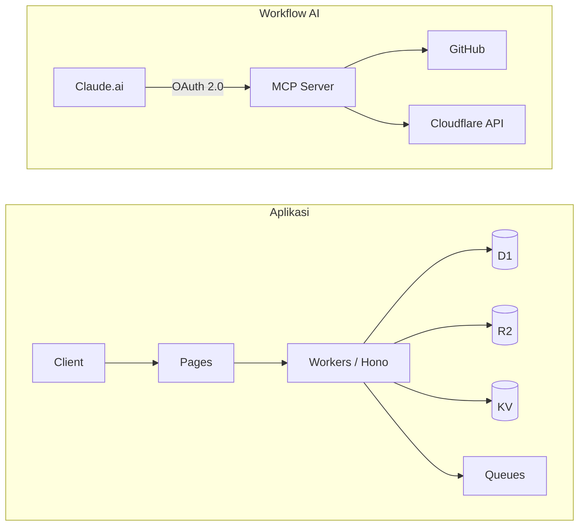

 

 

## Tentang

Saya **Moeid**, developer dari **Surabaya, Indonesia**. Pekerjaan harian saya di PPIC (Production Planning & Inventory Control). Di luar itu, saya membangun dan mengkomersilkan produk digital lewat **[MuidSoft](https://muidsoft.com)**.

Semua produk dibangun **Cloudflare-native**: Workers, D1, R2, KV, Queues, dan Durable Objects. Serverless, edge-first, dan hemat biaya. Claude terintegrasi langsung ke workflow lewat **custom MCP Server**, dan seluruh development saya kerjakan dari **Android + Termux**.

<table>
  <tr>
    <td align="center" width="33%" valign="top">
      <b>Edge-first</b> 
      Serverless di Cloudflare. Latensi rendah, biaya efisien.
    </td>
    <td align="center" width="33%" valign="top">
      <b>AI-integrated</b> 
      Claude terhubung lewat MCP Server dengan OAuth 2.0.
    </td>
    <td align="center" width="33%" valign="top">
      <b>Mobile-first dev</b> 
      Ngoding penuh dari Android lewat Termux.
    </td>
  </tr>
</table>

 

## Proyek

<table>
  <tr>
    <td width="50%" valign="top">
      <h3>KASIR CLOUD</h3>
      <b>POS &middot; sudah dipakai toko nyata</b>
      
Sistem POS cloud berbasis Hono, D1, dan R2. Preorder DP / Lunas / Belum Bayar, laporan profit, thermal printer, barcode scan, tren penjualan Chart.js, activity log, dan mode offline via Termux.

      

        
        
        
      

    </td>
    <td width="50%" valign="top">
      <h3>MuidSoft Gen Video</h3>
      <b>AI video &middot; multi-provider</b>
      
Platform AI video generation di Cloudflare Workers. Provider pool (Kling AI, Runway, Luma) dengan quota-aware routing, storage R2, Hono + Queues + Drizzle, dan arsitektur adapter pattern.

      

        
        
        
      

    </td>
  </tr>
  <tr>
    <td width="50%" valign="top">
      <h3>Etalase Toko WA</h3>
      <b>WhatsApp storefront</b>
      
Galeri produk multi-foto, order history, quota enforcement, validasi file magic-byte, numbered D1 migrations, dan dokumentasi ARCHITECTURE.md lengkap.

      

        
        
        
      

    </td>
    <td width="50%" valign="top">
      <h3>Harvey MCP Server</h3>
      <b>AI tooling &middot; Claude.ai connected</b>
      
Custom MCP Server di Cloudflare Workers yang terhubung langsung ke Claude.ai, dengan full OAuth 2.0 flow. AI mengakses tool dan data secara real-time.

      

        
        
        
      

    </td>
  </tr>
  <tr>
    <td width="50%" valign="top">
      <h3>INVENTORY</h3>
      <b>Warehouse management internal</b>
      
Tracking inbound/outbound, rekap Chart.js, frontend Cloudflare Pages, backend Google Apps Script. Sedang refactor dengan outbound draft system.

      

        
        
        
      

    </td>
    <td width="50%" valign="top">
      <h3>JalurTarot</h3>
      <b>Aplikasi tarot web</b>
      
Aplikasi tarot berbasis web untuk pasar Indonesia. Workers API + Pages frontend, D1 + KV + R2, integrasi OpenRouter AI, dan aset visual dari nol termasuk logo SVG custom.

      

        
        
        
      

    </td>
  </tr>
</table>

 

## Arsitektur

 

## Tech Stack

| | |
|:--|:--|
| **Cloudflare** |        |
| **Bahasa & framework** |        |
| **Data** |     |
| **Tooling** |      |

 

## Statistik

 

## Kontak

  

