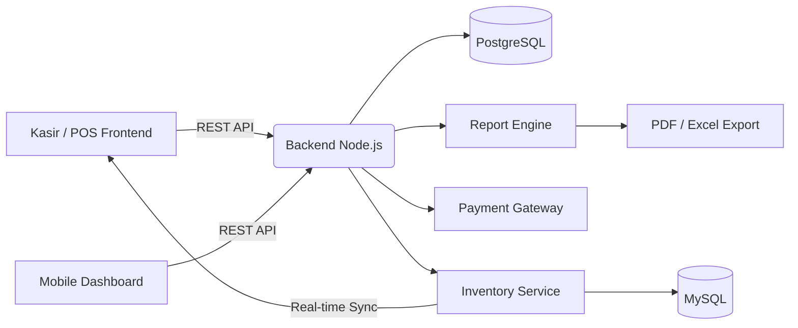

 

 

## Profil

Saya adalah pengembang perangkat lunak yang berfokus pada perancangan dan pembangunan **sistem Point of Sale (POS) dan manajemen Inventory** untuk pelaku Usaha Mikro, Kecil, dan Menengah (UMKM) di Indonesia. Fokus saya adalah menghadirkan teknologi kelas enterprise dengan pengalaman pengguna yang sederhana dan biaya yang terjangkau.

| | |
|---|---|
| **Peran** | Full-Stack Developer — POS & Inventory Systems |
| **Fokus Industri** | Retail, F&B, UMKM Digitalization |
| **Lokasi** | Indonesia |
| **Misi** | Membantu UMKM naik kelas melalui sistem digital yang andal |
| **Sedang Didalami** | Cloud Architecture, Offline-First Sync, Payment Gateway |
| **Terbuka Untuk** | Kolaborasi proyek UMKM, Freelance, Full-time |

 

## Dampak &amp; Pencapaian

Ganti angka di atas dengan metrik nyata dari proyekmu — data konkret jauh lebih meyakinkan bagi recruiter dan klien.

 

## Proyek Unggulan

<table>
<tr>
<td width="50%" valign="top">

### POS System UMKM
Aplikasi kasir modern dengan transaksi real-time, dukungan multi-outlet, cetak struk otomatis, dan integrasi berbagai metode pembayaran.

`React` `Node.js` `PostgreSQL`

**Kemampuan Utama**
- Checkout dalam hitungan detik
- Sinkronisasi multi-cabang
- Laporan penjualan otomatis harian/bulanan
- Mode offline-first — transaksi tetap jalan tanpa internet

</td>
<td width="50%" valign="top">

### Inventory Management System
Sistem manajemen stok real-time dengan notifikasi otomatis, pelacakan barang masuk/keluar, dan integrasi langsung dengan sistem POS.

`TypeScript` `Express` `MySQL`

**Kemampuan Utama**
- Notifikasi stok menipis otomatis
- Audit trail pergerakan barang
- Terintegrasi penuh dengan modul POS
- Analitik produk terlaris dan slow-moving

</td>
</tr>
</table>

 

## Arsitektur Sistem

 

## Mengapa Sistem Ini Berbeda

| Kapabilitas | Dampak Nyata bagi UMKM |
|:---|:---|
| **Transaksi Instan** | Antrian pelanggan lebih pendek, perputaran lebih cepat |
| **Stok Real-Time** | Tidak ada lagi kehabisan barang tanpa disadari |
| **Akses Mobile** | Pemilik toko bisa memantau bisnis dari mana saja |
| **Laporan Otomatis** | Keputusan bisnis berbasis data, bukan asumsi |
| **Biaya Terjangkau** | Teknologi setingkat enterprise, harga ramah UMKM |
| **Offline-First** | Tetap jualan meski koneksi internet terputus |

 

## Tech Stack

**Frontend**
 

**Backend**
 

**Infra &amp; Tools**
 

 

## GitHub Analytics

 

## Connect

 

  

<i>"Digitalisasi UMKM, satu sistem POS pada satu waktu."</i>

